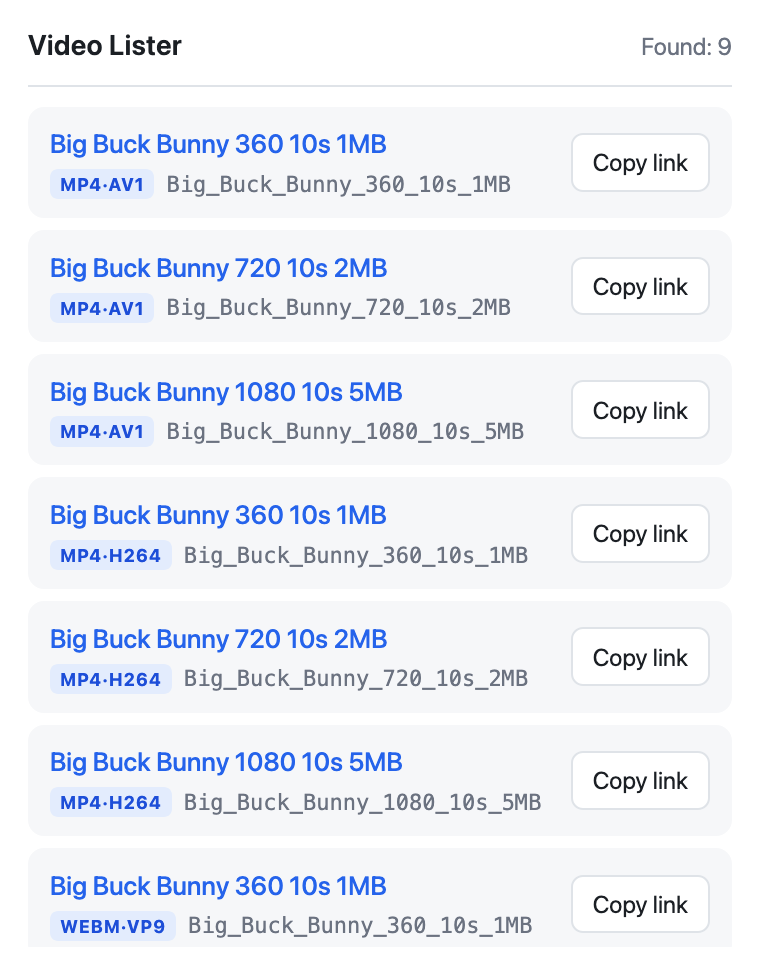

# Video Lister

A Firefox extension that lists the video on the page you are looking at. Click the toolbar
icon and you get every `.mp4`, `.webm` and `.ogg` it can find, plus any adaptive stream.
Open one in a tab, or copy its link.



## What it finds

- `<video src>`, `<source src>` inside a player, and ordinary `<a href>` links.
- DASH and HLS manifests (`.mpd`, `.m3u8`). Players assembled in JavaScript keep those in an
  inline script or a data attribute, out of reach of any selector, so the scan also sweeps the
  serialized markup.

Duplicates collapse into a single row, relative paths are resolved against the page, and a
`?query` or `#hash` after the file name does not hide it.

Titles come from `title`, the link text, `aria-label` or an image `alt`. When the link itself
says nothing useful, which is most of them on a download page, the scan looks at the
surrounding table cell or the heading above the player. Failing that it cleans up the file
name: `my-holiday_clip.mp4` becomes "My holiday clip".

## Streams need a second step

A manifest row is deliberately not a link, because opening a `.mpd` in a tab downloads a page
of XML rather than a film. Copy the link into VLC or mpv and they will play it.

Saving one is more work. DASH and HLS keep the picture and the sound in separate files. On
cda.pl a two hour film is a 592 MB video track next to a 235 MB audio track, with no combined
file on the server at all, so downloading the video track on its own gets you a silent film.
The button next to a stream copies a `yt-dlp` command, which fetches both tracks and muxes
them into one file.

## Install

For everyday use, load it from `about:debugging#/runtime/this-firefox` with **Load Temporary
Add-on** and pick `manifest.json`. Temporary add-ons disappear when Firefox restarts.

For hacking on it, `npm install && npm start` launches a separate Firefox profile with the
extension loaded and reloads it whenever you save a file.

## Permissions

- `activeTab` - read the current page, and only once you click the icon.
- `scripting` - inject the scanner on that click. There is no background script, so nothing
  runs on pages you never scan.
- `clipboardWrite` - the copy buttons.

It asks for no host permissions and makes no requests of its own. The manifest declares that
it collects no data.

## Development

```
npm test         # runs the scan against test/fixture.html in jsdom and asserts the results
npm run lint     # the same validator addons.mozilla.org runs
npm run build    # zip for AMO in web-ext-artifacts/
```

`test/fixture.html` is a page where every block pins one detection rule: a generic "Download"
label, the same label written with Polish diacritics, a duplicate URL, a relative path, a
manifest hidden in an attribute, a `blob:` source that must be ignored. `test/run.js` checks
the result entry by entry, verifies that every message key used in the popup exists in both
locales, and exits non-zero on any difference.

## Language

The interface follows the browser language: Polish in a Polish Firefox, English everywhere
else. Both live in `_locales/`. The list of useless link labels in `content.js` works the other
way round: it matches text on the page, so it stays multilingual whatever language the
interface is in.

## License

GNU General Public License v3.0 only. The full text is in `LICENSE`, and every source file
carries an SPDX header saying the same thing.

## Limits

- A URL that the page computes at runtime, decrypts or fetches over XHR is invisible to a
  markup scan. Catching those means watching network traffic with `webRequest`, which costs
  far broader permissions.
- The markup sweep can surface an address the page mentions but never plays.
- DRM-protected streams are out of scope.
